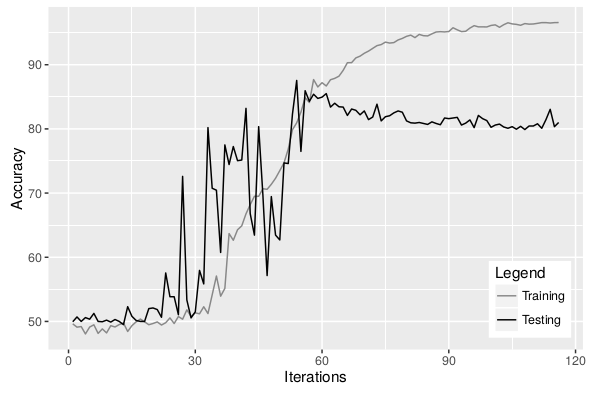

# Steganalysis via a Convolutional Neural Network using Large Convolution Filters

This project shows the code of the following paper.
http://arxiv.org/abs/1605.07946

The authors of this paper are:
Jean-François Couchot, Raphaël Couturier, Christophe Guyeux and Michel Salomon

This code is written with TORCH. It uses CNN in order to try to detect if an image is a cover or a stego. Currently this code has been tested with the HUGO, J-UNIWARD and WOW steganography tool and images of size 512x512. In order to train the network, a GPU with a lot of memory is needed (we have used a K40). In order to test some images a small GPU with 1Gb is sufficient.

In order to download the pre-trained networks, we need to go in the models directory and run download.sh.

In order to download many cover and stego images, we need to go in the images directory and run download.sh. These images come from the Raise database: http://mmlab.science.unitn.it/RAISE/

We suppose that images are named 1, 2, 3 etc

Here is the description of the CNN used for the steganalysis:

Evolution of the training and testing with HUGO (payload=0.4)

Evolution of the training and testing with HUGO (payload=0.1)

Other examples of training and testing are in the paper

.. image::  http://bilbo.iut-bm.univ-fcomte.fr:9001/up/1dfae9149eacceaf66e8a50feadea1bb.pres_equipe 
   :align: center
   :width: 800px

# Some examples

First you need to have cover and stego images and the pre-trained models

th train_stego.lua --cover images/cover_pgm  --stego images/stego_hugo_0.4  --start_test 1 --end_test 1000 --network models/model_hugo_04_iter41.t7 -p cuda 

th train_stego.lua --cover images/cover_pgm  --stego images/stego_wow_0.1  --start_test 1 --end_test 1000 --network models/model_wow_01_iter52.t7 -p cuda

th train_stego.lua --cover images/cover_jpg  --stego images/stego_uniward_0.1  --start_test 1 --end_test 1000 --network models/model_uniward_01_iter75.t7 -p cuda --ext .jpg

th train_stego.lua --cover images/cover_pgm  --stego images/stego_hugo_0.4  --start_train 1 --end_train 4000 --start_test 7001 --end_test 8000 -p cuda  -b 100

The interesting parameters are (take care of the double - for some parameters):
- --cover: the directory containing cover images
- --stego: the directory containing stego images
- --start_train: number of the first image to train
- --end_test: number of the last image to train
- --start_test: number of the first image to test
- --network: use a pre-trained model
- --end_test: number of the last image to test
- --p cuda: to run on cuda (necessary with our pretrained networks)
- -b: size of the batch for the training part (100 seems good), 
- --ext .jpg: if you want to use jpg images
